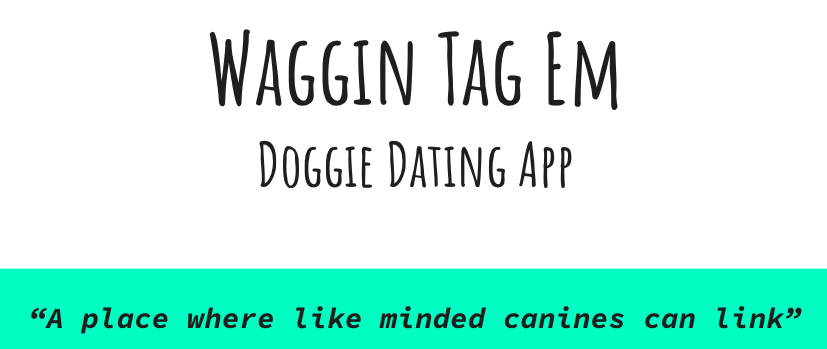
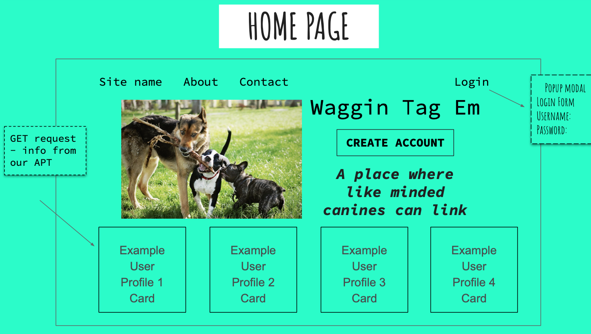

****

## Project overview 

- [Project Wireframe and Proposal PDF](./assets/wireframe.pdf) 

### Project Members:

* Felicia Wootton: [fdwootton](https://github.com/fdwootton)
* Pamela Hsu: [p-hsu](https://github.com/p-hsu)
* Stacy Brown: [Stacy-Martin](https://github.com/Stacy-Martin)

### Project Status:

**ONGOING**

#### Issues to debug:

**ONGOING**

## MVP

Humans have a wide variety of dating apps, so why not use one for our pup friends, they like to socialize too!  ‘Waggin Tag Em’ allows users to create pup profiles and contact users that have like-minded canine compatibilities and interests! 

### Project-build Aspects:

The following components are used to build the code for this project:

BACKEND: 
1. Handlebar.js: to handle templating language
2. Sequelize: to handle Object-relational Mapping
3. NPM packages:
    - express
    - express-session
    - express-handlebars
    - dotenv
    - bcrypt
    - connect-session-sequelize
    - multer
    - sequelize
    - mysql2
    - heroku addons:create jawsdb

FRONTEND:
1. CSS
    - Materialize
2. JavaScript
    - Materialize
    - Media Queries

### Functionality:

The following lists all functions within this project:

### Process:

#### Tasks

Designated tasts and project member initials: see [**Project Members**](#project-members) section for reference
* [x] wireframe: SM
* [x] `proposal.md`: PH
* [x] `README.md`: PH

BACKEND:
* [x] multer package and `datatype: BLOB` : SM/PH
* [x] Handlebars.js views : FW/PH
* [x] Sequelize controllers : FW/SM
* [x] Sequelize seeds : FW/PH/SM
* [x] Sequelize models : FW/PH/SM

FRONTEND:
* [x] CSS: FW
* [x] JS: FW/PH/SM

### Beyond MVP:

To create an additional HTML with a pup "friending" feature that also has the ability to search for friends by location and view saved pup friends.
****

## Installation

1. Clone this repository onto local workspace
2. Open Terminal (MacOS) or Git Bash (Windows) and change location to where you want the cloned directory
3. Type `git clone` and paste copied respository
4. Directory should include the following:
    * assets folder
        - images folder
        - javascript folder: `script.js`
        - css folder: `style.css`
    * `index.html`
    * `README.md`
    * `.gitignore` file

### Wireframe
Home page screenshot: please view the PDF file above for full wireframe

### MVP screenshot

****

## Deployment

Please use the following link to deploy a live URL of this project:

[Heroku deployed site](https://afternoon-waters-57666.herokuapp.com/)

****

## Credit

* **Waggin' Tag 'em** original concept and code collaborators:  Felicia Wootton || Pamela Hsu || Stacy Martin
* Mim Armand and Kat Poulos provided assistance and mentorship as the program instructor and teaching assistant respectivley
* Full-stack Bootcamp Program @ [Washington University, Saint Louis](https://bootcamp.tlcenter.wustl.edu/) through [© 2021 Trilogy Education Services, LLC, a 2U, Inc. brand](https://www.trilogyed.com/)

